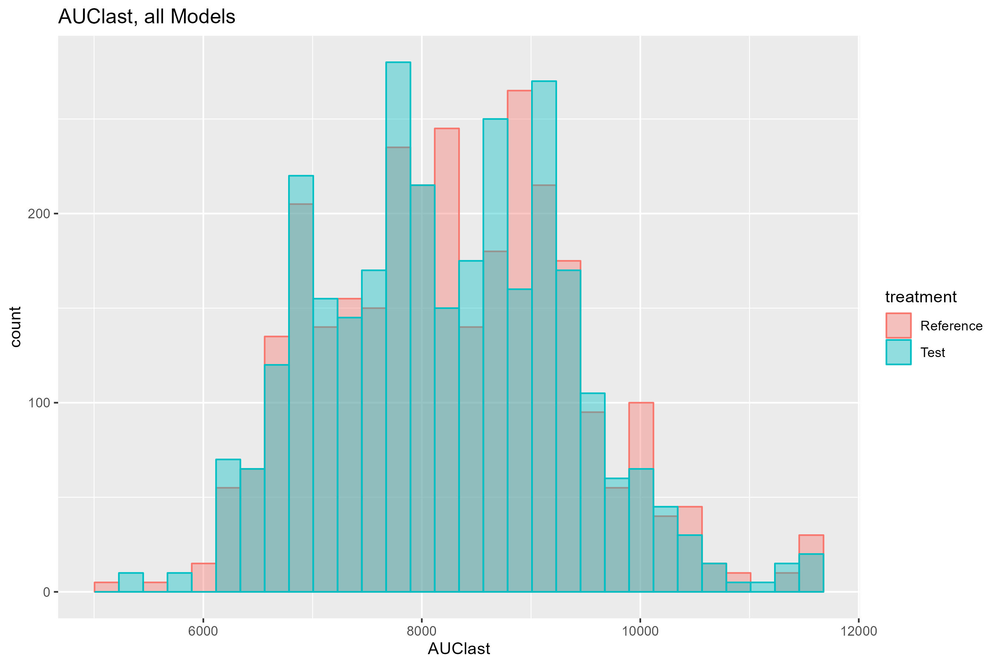

```{r options, include = FALSE}
knitr::opts_chunk$set(
  collapse = TRUE,
  comment = ""
  
)
```

```{r setup, echo=FALSE}
library(stringr)

```

### Files

Several files are needed for execution of the MBBE package. These are:

1.  Model files. Standard NONMEM control files, one or more describing
    one or more candidate models to be averaged.

2.  Data file(s) - one or two. An analysis data set for the NONMEM model
    estimation in the bootstrap step is required. In addition, a data
    file for simulation of the intended virtual BE study is typically
    used. The analysis and simulation data sets may be the same file.

3.  The MBBE specification file. A json format file describing the
    analysis methods and parameters.

4.  (Optional) User supplied R code that returns a value that can be
    added to the default model selection criteria (BIC) used for model
    averaging. The file must be called "RPenaltyCode.R" and include a 
    function called MBBE_RPenaltyCode. The function MBBE_RPenaltyCode must return a 
    numeric penalty.

## First you need model(s)

Five models are provided with the MBBE package. Any number of model \> 1
can be used, bearing in mind that the total number of bootstrap samples
will be the number of models x the bootstrap sample size. In the present
example, models were selected using
[pyDarwin](https://certara.github.io/pyDarwin/html/index.html). Example
models (model1.mod - model5.mod) are at:

```{r echo = FALSE}
models_path <- system.file(package = "mbbe","examples")
```

```{r, echo=FALSE}
file.path(models_path,list.files(models_path, pattern = "\\.mod$"))
```

Let's view an example model file:

```{r, echo = FALSE}
readLines(list.files(models_path, pattern = "\\.mod$", full.names = TRUE)[1])
```

These model need not have a \$COV record (unless that is needed for any
user defined R code). There are few restriction on the structure of the
model. However, there are a significant number of requirement for both
the control file and data file format. It is recommended that the full
path to the data set be provided in the \$DATA record.

There are four critical requirements of the model files data sets. There
are:

1.  The values

-   TRT (treatment)

-   GROUP

-   PERIOD

-   SEQ (sequence)

    Note, these data items must be provided in the analysis data set as
    well as the simulation data set, even if they are not used. The
    GROUP (treatment and reference groups) must be used in the model.
    However, PERIOD and SEQ need not be included in the analysis model
    (and so can be all the same values, e.g., all "1"s). All four data
    items need to be included in the simulation data set (reflecting the
    multiple period cross over study design), and so must also be in the
    analysis data set and the \$INPUT record in the analysis control
    file(s).

2.  Only THETAs may be estimated. To accomplish this, \$OMEGA and
    \$SIGMA block can be FIXed to 1 and ETAs and EPSs multiplied by a
    THETA, see examples at

```{r include=FALSE}
models_path <- file.path(system.file(package = "mbbe"),"inst","examples")
if( .Platform$OS.type == "windows" )
  models_path <- str_replace_all(models_path,"//","\\")
```

```{r, echo=FALSE}
cat(models_path)
```

3.  The \$ESTIMATION record, followed by the \$THETA block MUST be the
    final two blocks in the control file (with the exception of any
    \$TABLE records that might be needed for any user supplied R code).

4.  The line

\|;;;; Start EST.

must appear immediately before the \$EST record. The reason for these
two requirements is that the simulation control files are constructed
from the analysis control files. All content in the analysis control
file is copied, then everything after the line

\|;;;; Start EST

is removed and replace with a \$SIM record, followed by the theta
estimates extracted from the .xml file for that model and bootstrap
sample. A \$TABLE record is then added, with data items required for the
power calculation. Note that this \$TABLE record appended to the
simulation control file will include:

-   TRT

-   GROUP

-   PERIOD

-   SEQ

and so these data must be available, either (preferably) in both the
analysis and simulation data sets or calculated in the analysis control
file. In addition the \$DATA record is edited (programmatically by the R
code) to reference the simulation data set, rather than the analysis
data. Note that the \$INPUT record is preserved unchanged between the
user provided analysis control file and the generated simulation control
file, and so the structure of the analysis and simulation data sets must
be the same.

If identifiability check is requested, then the option "SADDLE_RESET=1"
must be included in the \$ESTIMATION record of the analysis control
file.

## Next you need two data sets (although they can be the same one)

Two formatted data set are provided here:

```{r include=FALSE}
data_path <- file.path(system.file(package = "mbbe"),"inst","examples","data.csv")
data_sim_path <- file.path(system.file(package = "mbbe"),"inst","examples","data_sim.csv")
if( .Platform$OS.type == "windows" )
  data_path <- str_replace_all(data_path,"//","\\")
if( .Platform$OS.type == "windows" )
  data_sim_path <- str_replace_all(data_sim_path,"//","\\")
```

```{r, echo=FALSE}
cat(data_path)
cat(data_sim_path)
```

Note that, in this case, these two data sets are identical. In general,
the analysis data set, for bootstrap, will not be the same as the
simulation data. For example, it may be the case that only sparse data
may be available for analysis (e.g., clinical scenarios were few samples
can be collected), or a cross over study may not be feasible (e.g., long
acting injectable drugs). Still the simulation must be done using a
traditional study design, e.g., 4 period, cross over study. The typical
scenario is to use a different study design that the study(ies) that
generated the analysis data, assuming that if the analysis data were
from an adequate BE study, those data would be used to assess BE, rather
than MBBE.

The analysis data set is specified on the \$DATA record in the NONMEM
control files for the bootstrap. The simulation data set is specified as
in the MBBE specification file:

```{r include=FALSE}
MBBE_file <- file.path(system.file(package = "mbbe"),"inst","examples","mbbeargs.json") 
if( .Platform$OS.type == "windows" )
  MBBE_file <- str_replace_all(MBBE_file,"//","\\")
```

```{r, echo=FALSE}
cat(MBBE_file) 
```

Several notes on the data:

1.  As discussed above, data item for "GROUP" (1,2 are reference, 3,4
    are test in the examples) are included both in the analysis data set
    and the simulation data set. This is the simplest way to include
    these required variables in the simulation and analysis. The example
    simulation data set (data_sim.csv) and the source data set
    (data.csv) are both 4 period cross over studies, and so there are 4
    values for group (although only 2 formulations). It is not a
    requirement that the source data be a typical 4 period cross over
    study, although data for both test and reference formulation need to
    be included in order to estimate any formulation effects.

2.  Data item for "PERIOD" is provided (1-4). In general, between
    occasion variability (e.g., by study period) should be assessed and
    included in the model(s) if supported. The PERIOD data item is
    recommended in both the analysis and simulation data sets. If it is
    not included in the data set it must be calculated in the control
    file so it can be included in \$TABLE output for the simulations,

3.  Data item for sequence ("SEQ") is provided (1-2). Presumably, period
    and sequence were tested in the model selection and not found to be
    supported. However, similar to PERIOD, SEQ is required for the Monte
    Carlo simulation and statistical testing to be available for output
    in the \$TABLE step.

## User supplied penalty R code

The model averaging is, by default, based on the Bayesian Information
criteria (BIC), with the option to exclude any results that fail the
[Identifiability
test](https://www.page-meeting.org/pdf_assets/1345-PAGE_2017_SADDLE_RESET_Final.pdf).
Another, more general option is to include a user defined R function, to
return a penalty that is added to the BIC. The path to the file
containing this function can be specified in the R_code_path option in
the MBBE specification file, and the user_R\_code option set to "true".
The function must take the arguments:

-   run_dir - the parent run directory, as specified in the MBBE
    specification file

-   this_model - the model number

-   this_samp - the bootstrap sample number.

These arguments can then be used to access any output from the NONMEM
bootstrap model, such the .lst file, the .xml file. The path to the
model output files (.xml, .lst, .ext etc., as well as any \$TABLE
output) will be

run_dir/modelM/N

Where run_dir is the run directory (run_dir) specified in the MBBE
specification file, M is the model number and N is the bootstrap sample
number. The NONMEM output (.lst) and xml (.xml) files will be called:

bsSampM_N.lst

and bsSampM_N.xml

respectively, where M is the model number and N is the bootstrap sample
number. Other standard NONMEM output (e.g., .ext, .cor etc.) are
similarly named. Any \$TABLE file output, including \$SIM output, that
is specified in the analysis control files can be accesses as well,
using the file structure information described above.

The user defined R function should return, in all case, a numeric
penalty. An example R script to return a penalty for bias in simulated
Cmax is given in RPenaltyCode.R. This function requires that a 2nd
problem (for simulation) be included in the control files. An example
where RPenaltyCode.R returns a penalty for bias in prediction of Cmax is
given in:

```{r include=FALSE}
Rcode_path <- file.path(system.file(package = "mbbe"),"inst","example","RPenaltyCode.R")
if( .Platform$OS.type == "windows" )
  Rcode_path <- str_replace_all(Rcode_path,"//","\\")
```

```{r, echo=FALSE}
cat(Rcode_path)
```

### The MBBE Specification file

An example MBBE specification file is given at:

```{r include=FALSE}
MBBE_file <- file.path(system.file(package = "mbbe"),"inst","examples","mbbeargs.json")
if( .Platform$OS.type == "windows" )
  MBBE_file <- str_replace_all(MBBE_file,"//","\\")

```

```{r, echo=FALSE}
cat(MBBE_file)
```

The json file consists of key-value pairs. All pairs are required,
except "R_code_path": is not required if "user_R\_code": if set to
false.

The key-value pairs are:

##### "run_dir":

(string) parent directory where NONMEM is to be run. The bootstrap runs
will be executed in run_dir/modelM/N.

Where M is the model number and N is the bootstrap sample number. The
output (.lst) and xml (.xml) files will be bsSampM_N.lst and
bsSampM_N.xml.

##### "model_source":

(list) A list of paths to the candidate models. JSON syntax for list is:
["path1", "path2, ...]. Note that separator in path will be forward
slash "/" for any operating system.

##### "num_parallel":

(integer) Number of NONMEM executions to be run in parallel. In general
should not exceed the number cores.

##### "crash_value":

(numeric) A value to be assigned to the model selection criteria if the
calculation fails. Should be larger than any anticipated value for BIC +
any R penalty.

##### "nmfe_path":

(string) Path to nmfe??.bat. Note that separator in path will be forward
slash "/" regardless of operating system.

##### "delta_parms":

(numeric) Largest absolute fractional difference between any parameters
before and after the SADDLE_RESET that is permitted. Any model/sample
with a value larger than delta_parm will result in a failed
identifiability test for that model/sample and will be excluded for the
model averaging. If all models for a given sample fail the
identifiability test, that sample is excluded from the Monte Carlo
simulation.

##### "use_check_identifiable":

(logical) true or false, if identifability is to be checked.

##### "NCA_end_time":

(numeric) End time for calculation of AUC.

##### "rndseed":

(integer) Random seed for Bootstrap sampling and Monte Carlo Simulation.

##### "simulation_data_path":

(string) Path to simulation data set. Note that the separator in path
will be operating system dependent, as this text is simply copied
unchanged into the \$INPUT record.

##### "ngroups":

(integer) Number of GROUPs.

##### "samp_size":

(integer) Number of bootstrap and Monte Carlo Simulations.

##### "reference_groups":

(list of integers) Which of the GROUPs are reference formulation

##### "test_groups":

(list of integers) Which of the GROUPs are test formulation

##### "plan":

(string)- strategy for running R parallel. [Options
are](https://rdrr.io/cran/future/man/plan.html):

-   sequential: Resolves futures sequentially in the current R process,
    e.g. plan(sequential).

-   multisession: Resolves futures asynchronously (in parallel) in
    separate R sessions running in the background on the same machine,
    e.g. plan(multisession) and plan(multisession, workers = 2).

-   multicore: Resolves futures asynchronously (in parallel) in separate
    forked R processes running in the background on the same machine,
    e.g. plan(multicore) and plan(multicore, workers = 2). This strategy
    is not supported on Windows.

##### "alpha_error":

(numeric)- alpha error for computing one sided T tests.

##### "NTID":

(logical) true or false, whether this is a narrow therapeutic index
drug.

##### "model_averaging_by":

(string) "study" \| "subject". "study" is recommended, "subject" is
experimental.

##### "user_R\_code":

(logical) true or false, if user supplied R code is to be run and
included in model averaging penalty. If true, R_code_path is required.

##### "R_code_path":

(string) - path to user supplied R code for calculating additional
penalty for model averaging.

### Execution

MBBE is executed from the command line with

*mbbe::run_mbbe_json("path")*

where *"path*" is the path to the MBBE specification file.

## Output

## Console output

The start date and time of each event in the MBBE process will be
listed. The initial output from MBBE describes the options for running
MBBE and results of checks.

When the bootstrap starts, MBBE will print out a progress line that
describes what percent of the bootstrap models have been started.
Completion of the bootstrap step will occur after all the models are
started, and then completed.

Various status update message will be displayed as the bootstrap is
completed, model parameters are collected, if requested, user supplied R
code penalty etc.

Once the BIC and total penalty values are calculated, they will be
displayed.

When available, the estimated power for Cmax, AUC~last~ and
AUC~infinity~ will be displayed and the number of bootstrap sample for
each model that are identifiable is output.

Finally, the statistical output includes, for each Monte Carlo
simulation, whether the parameters (Cmax, AUC~last~ and AUC~infinity~)
are bioequivalence, the ratio for each and the upper and lower limits of
the confidence interval for the ratio.

### File output

Comma separated value (.csv) files with BIC values will be written to

run_dir/BICS.csv

and total penalties written to

run_dir/Total_penalties.csv

where run_dir is the run directory specified in the MBBE specification
file.

The power for each parameter is written out to the file

run_dir/MBBEpower[data-time].csv

where [data-time] is the analysis completion date and time.

All statistical results are written to run_dir/All_results.csv.

## Running the example.

An example can be run using the provide control files, data sets and
mbbe options file with the command:

mbbe::run_example(run_dir, nmfe??.bat, Include_R\_Code, plan)

where:

-   run_dir (string) is the parent directory for NONMEM execution

-   nmfe??.bat (string) is the full path to the nmfe??.bat file, where
    ?? is the NONMEM version (e.g., c:/nmfe74/util/nmfe74.bat)

-   Include_R\_Code = (logical), whether to include the (provided)
    script for a penalty in the model averaging. R script can be found
    in the file RPenaltyCode.r in run_dir. Default value is FALSE

-   plan is one of "sequential", "multicore", "multisession" with a
    default of "multisession"

The num_parallel will be set to the (number of cores - 1) or 1 if there
is only 1 core, and the analysis executed. Execution on a 32 core
machine with Include_R\_Code set to FALSE takes \~4 minutes and \~8
minutes on a 4 core machine. The sample size for the bootstrap and Monte
Carlo simulation is set to only 4, which will give a very poor estimate
of power. To reduce execution time, the FO method is used for the
bootstrap, rather than FOCEI.

Once the command is issued, the code will check if the run directory
(run_dir) is present, and if so, will ask permission to delete it. The
dialog that appears for ask permission may not be on top. If the
directory needs to be deleted, click the "OK" button.

Once started, various checks are performed and display of many of the
analysis parameters including the path(s) to the analysis model(s). An
example, where the run_dir is set to c://mbbe_ex is given below.

`if c:/mbbe_ex exists, a dialog will appear asking permission to remove it, it may not be on top`

`No additional penalty for model averaging will be used`

`MBBE will be run 7 x parallel`

`Estimated run time for example = 14 minutes`

`Example mbbe arguments file is at c:/mbbe_ex/example.json`

`2023-11-21 11:33:12 Start time`

`Model file(s) =`

`c:/mbbe_ex/model1.mod`

`c:/mbbe_ex/model2.mod`

`c:/mbbe_ex/model3.mod`

`c:/mbbe_ex/model4.mod`

`c:/mbbe_ex/model5.mod`

`reference groups = 1, 2`

`test groups = 3, 4`

`Run Directory = c:/mbbe_ex/example`

`Number of groups = 4`

`Model averaging will be by study`

`Bootstrap/Monte Carlo sample size = 5`

`nmfe??.bat path = c:/nm74g64/util/nmfe74.bat`

`Use_check_identifiability = FALSE`

`Narrow Therapeutic Index  = FALSE`

`Alpha error rate for bioequilvalence testing = 0.05`

`Number parallel runs for bootstrap, simulations and NCA = 7`

`Simulation data set = c:/mbbe_ex/data_sim.csv`

`Simulation data path = c:/mbbe_ex/data_sim.csv`

`Not using post run R code for model averaging selection`

After displaying the analysis parameters and options, the list of file
outputs will be displayed, e.g.,

`BICs values will be written to c:/mbbe_ex/example/BIC.csv`

`Total Model averaging penalties will be written to c:/mbbe_ex/example/Total_penalties.csv`

After that, the parameter values will be checked for consistent, the
path(s) to nmfe??.bat and the R code if requested will be checked. If
requirements are passed, the message:

`Passed requirements check`

will be displayed, otherwise error messages will be shown.

Once the checks are execution will begin, with messages about copying
the control files, sampling the data and starting the bootstrap model
runs. During the bootstrap model runs, a progress bar will be shown,
based on the number of bootstrap models **started** (not finished).

Once the bootstrap model runs are done, the BIC values will be
displayed, e.g.,

`BICS =`

`Model1   Model2   Model3   Model4   Model5 Best Max_Delta_parm Max_Delta`

`1 9624.202 9643.253 9626.252 9650.211 9643.971    1           -999      -999`

`2 9653.113 9696.959 9653.207 9658.488 9651.800    5           -999      -999`

`3 9272.172 9354.862 9272.172 9318.539 9304.562    1           -999      -999`

`4 9731.254 9779.648 9731.458 9754.807 9771.924    1           -999      -999`

`5 9147.007 9181.334 9143.620 9167.294 9155.821    3           -999      -999`

In this case, identifiability was not requested and so the
Max_Delta_parm and Max_Delta are not available (value = -999).

After the BIC values the total penalties (which is BIC+ any penalty from
the user supplied R code) will be displayed. In this case, as no use
supplied R code is used, they will be the same as the BICs.

`Total Penalties for bootstrap models =`

`Model1   Model2   Model3   Model4   Model5`

`1 9624.202 9643.253 9626.252 9650.211 9643.971`

`2 9653.113 9696.959 9653.207 9658.488 9651.800`

`3 9272.172 9354.862 9272.172 9318.539 9304.562`

`4 9731.254 9779.648 9731.458 9754.807 9771.924`

`5 9147.007 9181.334 9143.620 9167.294 9155.821`

Next, messages will appear about the simulations, and a progress bar
reflecting the number simulations

that have started. After simulations are done, the NCA parameters from
the simulations are calculated. Histograms are generated from these NCA
parameters (Cmax, AUCinf and AUClast). The path to these plots are
displayed:

`2023-11-21 11:39:32 Plots are saved in c:/mbbe_ex/example`

The elapse time is then shown, and the power for finding BE is given
for Cmax, AUClast and AUCinf:

`$Cmax_power`

`Power`

`1     1`

`$AUClast_power`

`Power`

`1     1`

`$AUCinf_power`

`Power`

`1     1`

The number of samples for each model that are identifiable is printed,
and finally the NCA statistics (Ratios of reference to test, upper and
lower limits and whether BE is shown) are printed

`$NCA_stats`

`Cmax_BE Cmax_Ratio Cmax_lower_CL Cmax_upper_CL AUClast_BE AUClast_Ratio AUClast_lower_CL`

`1    TRUE   99.63386     0.9880040     1.0047434       TRUE      99.39984        0.9900570`

`2    TRUE   98.85888     0.9807576     0.9964826       TRUE      99.63649        0.9927208`

`3    TRUE   98.86239     0.9802479     0.9970713       TRUE      99.48245        0.9913762`

`4    TRUE   99.83804     0.9898971     1.0069365       TRUE     100.06885        0.9970103`

`5    TRUE   99.75044     0.9885444     1.0065455       TRUE      99.76438        0.9944456`

`AUClast_upper_CL AUCinf_BE AUCinf_Ratio AUCinf_lower_CL AUCinf_upper_CL`

`1        0.9979555      TRUE     99.39840       0.9900409       0.9979428`

`2        1.0000224      TRUE     99.63729       0.9927314       1.0000279`

`3        0.9982847      TRUE     99.48119       0.9913649       0.9982709`

`4        1.0043803      TRUE    100.06714       0.9969955       1.0043608`

`5        1.0008522      TRUE     99.76512       0.9944545       1.0008582`

The histograms for AUCinf, AUClast and Cmax for test and reference in
the simulated studies are shown below. This plots are also saved to the
run directory.

{width="460"}

{width="460"}

{width="460"}
